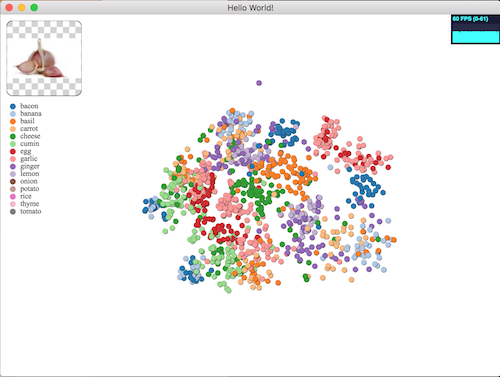
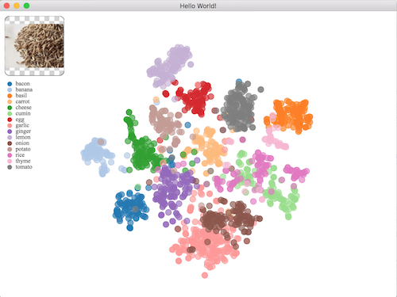

t-SNE visu
==========


Install
-------

```
> npm install
```

Build
-----

```
> npm run build
```

then

```
> npm run watch
```

to update the code automaticaly

Run
-----

```
> npm run start
```

The dataset is quite big (~32MB), then the init and t-SNE first results take a bit of time.
But you should have a first rendering after 20s.

Example of 3D output (using ThreeJS and WebGL):




Example of 2D output (using D3 and SVG):




Configuration
---------------

in `src/views/TSNEView.js`

change `const RENDER_DIM = 3` to `const RENDER_DIM = 2` for 2D rendering.
